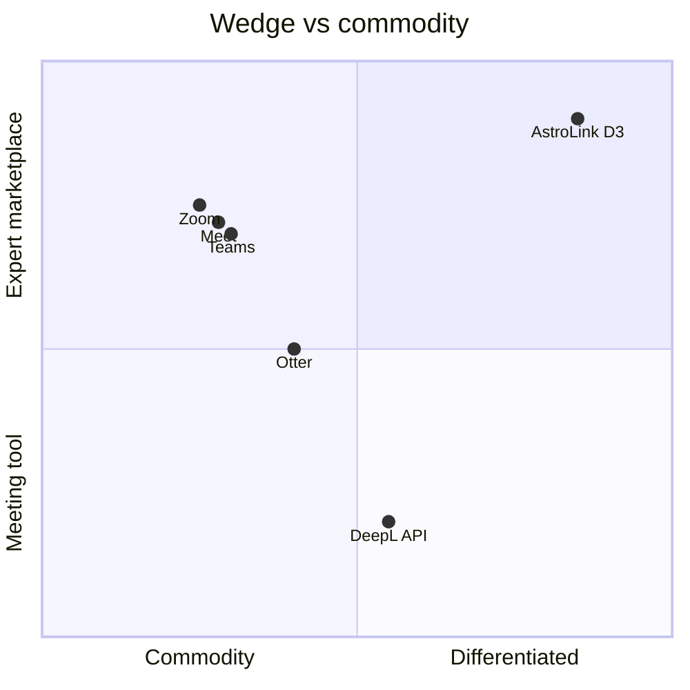

# Case studies — transcript translation in comparable products

How others ship multilingual meeting intelligence, and what AstroLink should copy, avoid, or differentiate.

**Audience:** Product + engineering  
**Related:** [D3 roadmap](../d3-transcript-translation-roadmap.md)

---

## 1. Zoom AI Companion (2024–2025)

**What they ship**

- Live translated captions in 30+ languages (paid plans).
- AI Companion 2.0: summaries and action items derived from translated caption stream.
- Zoom's 2025 AI Quality Report (TestDevLab): led English→French, English→Spanish, English→Japanese caption quality vs Teams, Meet, Otter.

**Architecture (inferred)**

- Streaming ASR → machine translation → caption renderer.
- Summaries generated from caption text, not a separate high-fidelity transcript.

**Lessons for AstroLink**

| Copy | Avoid | Differentiate |
|------|-------|---------------|
| Sub-2s caption UX expectation | Generic glossary-free MT for technical domains | Aerospace term preservation + APX-02 context |
| Translated summaries as premium AI value | Building a general meeting product | Paid expert session + escrow + recap as product unit |

**AstroLink v1 equivalent:** Phase 3 live captions + Phase 2 localized APX-03 recap — scoped to `/session/[id]`, not a Zoom competitor.

---

## 2. Microsoft Teams Interpreter (GA Feb 2025)

**What they ship**

- Live captions in 40+ languages.
- **Interpreter agent:** speech-to-speech in 9 languages with voice simulation (Copilot bundle).
- Meeting summaries localized per participant language.

**Lessons**

| Copy | Avoid | Differentiate |
|------|-------|---------------|
| Per-participant language preference | Copilot-tier pricing complexity | Single buyer locale (mentee) simplifies v1 |
| Summary in listener's language | Voice cloning in v1 (regulatory overhead) | Text captions + written recap first |

**AstroLink positioning:** Teams wins enterprise M365. AstroLink wins **buyer pays $X for 45 min with a named expert** — translation is a conversion lever for global mentees, not a collaboration suite feature.

---

## 3. Google Meet + Gemini (2025)

**What they ship**

- Real-time translated captions in 60–100+ languages.
- "Adaptive Audio" for multi-speaker rooms.
- Gemini note-taking in translated language (Workspace Business+).

**Lessons**

| Copy | Avoid | Differentiate |
|------|-------|---------------|
| Broad language coverage as roadmap | Racing to 100 languages before quality | Curate 5 launch locales with glossary QA |
| Gemini-powered notes from captions | Tight Google Workspace dependency | Supabase + Stripe + Daily stack independence |

---

## 4. Cross-border telehealth (Forasoft case study, ~12K MAU)

**What they did**

- Moved from Zoom-native captions to: **LiveKit WebRTC + Google STT + Translation API** for live captions.
- **Interprefy hybrid** for consent sections (~2.1% of sessions).
- HIPAA audit log in own AWS account.

**Outcomes reported**

- ~850 ms end-to-end caption latency.
- Clinician satisfaction 91% (up from 64% on Zoom).
- ~$0.062/min Google + $0.18/min on human escalation ≈ $12.3K/month at 180K minutes.

**Lessons for AstroLink**

| Copy | Avoid | Differentiate |
|------|-------|---------------|
| Hybrid AI + human escalation for high-stakes moments | Custom WebRTC in D3 (Daily is sufficient) | ITAR/export-control **flag → ops review** instead of live human interpreter in v1 |
| Own the audit log | Rebuilding video infra | Daily transcription + AstroLink translation layer |
| Measure satisfaction by cohort | — | Track non-English buyer repeat rate |

**AstroLink D4 path:** Interprefy-style escalation when APX-04 flags transcript segment — not Phase 3.

---

## 5. Otter.ai

**What they ship**

- High-accuracy transcription (92%+ claimed), summaries, action items.
- Integrations with Zoom/Teams; not native translation-first.

**Lessons**

| Copy | Avoid | Differentiate |
|------|-------|---------------|
| Strong post-meeting artifact UX | Competing on generic transcription accuracy | Expert session recap tied to booking + payment |

---

## 6. DeepL + API-first products

**What they ship**

- Best-in-class document/text translation; API for developers.

**Lessons**

| Copy | Avoid | Differentiate |
|------|-------|---------------|
| Consider DeepL API for batch recap if LLM cost &gt; API at scale | Losing session context (speaker, timing) | LLM translation with glossary + objectives in v1; API as Phase 4 cost optimization |

---

## AstroLink product shape (synthesis)

### What "ours" looks like

**Buyer journey**

1. Books Chris (English-speaking propulsion expert) from Brazil.
2. Checkout: `preferred_locale = pt-BR` (optional, default from profile).
3. Pre-call brief (APX-02): generated in English today; Phase 2+ can add brief translation slice.
4. Live session: expert speaks English; buyer sees **Portuguese captions** with terms like "Merlin engine" preserved.
5. Post-session: **Portuguese recap** (summary, insights, action items) + English canonical in DB for ops.
6. Dashboard: "Sua sessão com Chris" — localized recap card drives rebooking.

**Mentor journey**

- Minimal change in v1: speak naturally in English.
- Session shell shows "Buyer language: Português (captions on)".
- Optional Phase 4: mentor-provided glossary terms for their specialty.

**Ops / compliance**

- English transcript in `session_transcripts` for APX-04 moderation.
- `audit_log` entries for each translation job (XPRIZE T8 alignment).

---

## Feature comparison matrix

| Capability | Zoom | Teams | Meet | AstroLink D3 |
|------------|------|-------|------|--------------|
| Live translated captions | ✅ | ✅ | ✅ | Phase 3 |
| Localized AI summary | ✅ | ✅ | ✅ | Phase 2 |
| Aerospace glossary | ❌ | ❌ | ❌ | ✅ |
| Paid expert + escrow | ❌ | ❌ | ❌ | ✅ |
| Pre-call AI context in translation | ❌ | ❌ | ❌ | ✅ (APX-02) |
| Compliance transcript trail | Partial | Partial | Partial | ✅ (canonical EN) |

---

## Recommended narrative (GTM)

> "The only marketplace where you can book a verified aerospace expert and follow the session in your language — with technical terms preserved and a recap you can act on."

Not: "We have captions."  
Yes: "Global access to expertise that was previously English-gated."

---

## Related

- [D3 roadmap](../d3-transcript-translation-roadmap.md)
- [Architecture](./transcript-translation-architecture.md)
- [Engineering review](./transcript-translation-engineering-review.md)
