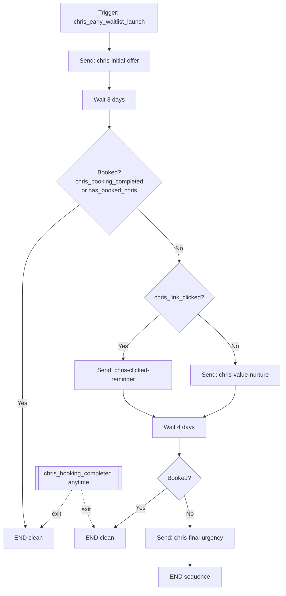

# Chris Sembroski Early Waitlist → $180 Booking Sequence

**Automation name:** `Chris Sembroski Early Waitlist to $180 Booking Sequence`  
**Status:** Templates shipped on `main` (PRs #73–#74). Production blast is still **manual** in Resend Broadcasts / ESP — paste HTML from code; the app does not auto-send this marketing sequence.  
**Goal:** Convert early waitlist contacts into paid 45-minute 1:1 sessions with Chris at **$180** (`ref=early-signups`), **15 slots**, without fighting the existing post-payment emails (confirmation + AI brief).

## From address

Default Resend sender (override with `RESEND_FROM`): `AstroLink <notifications@astro-link.space>`.  
Verify that address (or the domain) in the Resend dashboard before production sends.

## Important: what Resend already does vs this sequence

| Layer | Role |
|-------|------|
| **Existing AstroLink + Resend** | Transactional only after book: Chris date-hold ticket, AI pre-brief, mentor prep, etc. (`sendEmail` + code HTML). |
| **This automation** | Pre-booking marketing sequence for waitlist → booking link. **Does not** replace booking confirmation. |
| **Exit rule** | Anyone who books must **leave this sequence immediately** so they only get the real booking emails. |

Resend’s product API today is strong at **send + templates + audiences**. Full multi-step **Wait for event / branch on click** journeys are usually run in:

1. **ESP journey tool** (Loops, Customer.io, Resend Broadcasts + suppressions, etc.) that calls Resend or its own SMTP, **or**
2. **AstroLink-owned sequencer** (cron + contact state in Supabase + our 4 templates).

The workflow below is the **source of truth**. Implement it in either host; keep event names identical so Stripe/app can exit cleanly.

Code templates for the four emails live in:

`src/lib/email/chris-early-waitlist-sequence-templates.ts`

---

## Offer facts (lock in all copy)

| Fact | Value |
|------|--------|
| Session | 45-minute private 1:1 video with Chris Sembroski |
| Price | $180 early-access |
| Slots | 15 total (waitlist window) |
| CTA URL | `https://www.astro-link.space/talk-with-chris` |
| Recommended tracked CTA | `https://www.astro-link.space/talk-with-chris?ref=early-signups` (attribution; redirects still hit landing) |
| Variables | Email only. Greeting is always **Hey,** — waitlist never collected first name. Do not use `{{name}}` / `{{{FIRST_NAME}}}` in Resend. |

**Bonuses (all emails that list them):**

1. AI pre-call brief with suggested questions from their goals/background  
2. Post-call actionable brief  
3. Chris’s personalized follow-up note within 48 hours  
4. Call recording (subject to Chris’s approval)  
5. Curated 3-resource list Chris recommends for their goals  

**Guarantee:** Chris Preparation Guarantee — goals/questions/background reviewed before the call; if the session does not address what they submitted → follow-up resource package **or** priority reschedule at no extra cost.

---

## Custom events & contact properties

| Name | Type | When / who sets it |
|------|------|--------------------|
| `chris_early_waitlist_launch` | Custom event (trigger) | Launch day job: once per of 36 waitlist contacts with `{ email, name }` |
| `chris_booking_completed` | Custom event (exit) | Stripe `payment_intent.succeeded` when booking `campaign_id` is Chris campaign (or status becomes paid/confirmed for Chris) |
| `has_booked_chris` | Contact property `true` | Set with the exit event (idempotent) |
| `chris_link_clicked` | Contact property `true` | Click on tracked booking CTA (Resend click webhooks **or** `/r/chris-early` redirect that stamps contact then 302 to talk-with-chris) |
| `chris_sequence_email` | Optional property | Last template id sent: `chris-initial-offer` \| `chris-clicked-reminder` \| `chris-value-nurture` \| `chris-final-urgency` |

### Exit mapping from existing Stripe path

After payment succeeds and booking is Chris campaign:

1. Existing fulfillment still runs (confirm email + brief) — **unchanged**.  
2. **Additionally** fire automation exit:

```text
event: chris_booking_completed
payload: { email, name?, booking_id, campaign_id: "chris-sembroski" }
contact.has_booked_chris = true
```

If the ESP is external: HTTP “track event” API from `recordBookingPaymentSucceeded` / post-payment when `campaign_id` matches.  
If the sequencer is in-app: set `has_booked_chris` on a sequence membership row and stop further sends.

---

## Visual workflow

```text
┌─────────────────────────────────────────────────────────────────────────────┐
│  AUTOMATION: Chris Sembroski Early Waitlist to $180 Booking Sequence        │
└─────────────────────────────────────────────────────────────────────────────┘

  ● TRIGGER
  │  Custom event: chris_early_waitlist_launch
  │  Payload: { email, name }
  │  Audience: 36 early waitlist contacts (launch day fire-all)
  │
  ▼
┌──────────────────────────────────────┐
│ STEP 1 — Send immediately            │
│ Template: chris-initial-offer        │
│ Subject: Your early access slot…     │
│ CTA → talk-with-chris                │
└──────────────────────────────────────┘
  │
  ▼
┌──────────────────────────────────────┐
│ WAIT — 3 days                        │
│ (optional parallel: Wait for event   │
│  chris_booking_completed → END)      │
└──────────────────────────────────────┘
  │
  ▼
┌──────────────────────────────────────┐
│ CONDITION A — Booked?                │
│ Event chris_booking_completed        │
│   OR property has_booked_chris=true  │
└──────────────────────────────────────┘
  │                    │
  │ YES                │ NO
  ▼                    ▼
┌─────────┐   ┌──────────────────────────────────────┐
│ END     │   │ CONDITION B — Clicked Email 1 CTA?   │
│ (clean) │   │ property chris_link_clicked = true   │
└─────────┘   └──────────────────────────────────────┘
                     │                    │
          YES (A)    │                    │ NO (B)
                     ▼                    ▼
        ┌─────────────────────┐  ┌─────────────────────┐
        │ BRANCH A            │  │ BRANCH B            │
        │ chris-clicked-      │  │ chris-value-nurture │
        │ reminder            │  │                     │
        │ (clicked, no book)  │  │ (no click)          │
        └─────────────────────┘  └─────────────────────┘
                     │                    │
                     └──────────┬─────────┘
                                ▼
                 ┌──────────────────────────────────────┐
                 │ WAIT — 4 days                        │
                 │ (~7 days from trigger)               │
                 │ (optional parallel: Wait for         │
                 │  chris_booking_completed → END)      │
                 └──────────────────────────────────────┘
                                │
                                ▼
                 ┌──────────────────────────────────────┐
                 │ CONDITION C — Booked?                │
                 │ chris_booking_completed /            │
                 │ has_booked_chris                     │
                 └──────────────────────────────────────┘
                       │                    │
                       │ YES                │ NO
                       ▼                    ▼
                 ┌─────────┐   ┌──────────────────────────────────────┐
                 │ END     │   │ STEP FINAL — chris-final-urgency     │
                 │ (clean) │   │ Last early access chance…            │
                 └─────────┘   └──────────────────────────────────────┘
                                            │
                                            ▼
                                      ┌─────────┐
                                      │ END     │
                                      │ sequence│
                                      └─────────┘

Global rule: at ANY wait/condition, if chris_booking_completed fires → END.
Max emails per contact: 4 (initial + one branch email + final; a contact
never gets both Branch A and Branch B).
```

### Mermaid (for docs / Notion)



---

## Step labels (ESP checklist)

| ID | Type | Label |
|----|------|--------|
| T0 | Trigger | Launch: `chris_early_waitlist_launch` |
| E1 | Email | `chris-initial-offer` — immediate |
| W1 | Delay | Wait 3 days |
| W1b | Wait for event (optional parallel) | `chris_booking_completed` → End |
| C1 | Condition | Booked? → End |
| C2 | Condition | `chris_link_clicked`? |
| EA | Email | `chris-clicked-reminder` — Branch A |
| EB | Email | `chris-value-nurture` — Branch B |
| W2 | Delay | Wait 4 days |
| W2b | Wait for event (optional) | `chris_booking_completed` → End |
| C3 | Condition | Booked? → End |
| EF | Email | `chris-final-urgency` — final |
| X | End | Sequence complete |

---

## Template inventory

| Template id | Subject | When |
|-------------|---------|------|
| `chris-initial-offer` | Your early access slot with Astronaut Chris Sembroski is now open (only 15 spots) | Day 0 |
| `chris-clicked-reminder` | You started the process with Chris Sembroski - finish before the remaining slots close | Day ~3 if clicked, not booked |
| `chris-value-nurture` | What changes when you get 45 minutes of direct answers from someone who has been to space | Day ~3 if not clicked |
| `chris-final-urgency` | Last early access chance: 45 minutes with Chris Sembroski - slots closing | Day ~7 if still not booked |

Bodies are implemented in code (and can be pasted into an ESP template UI). See unit tests for subject + CTA assertions.

---

## Click tracking (Branch A vs B)

Resend open/click webhooks **or** first-party redirect:

```text
CTA href:
  https://astro-link.space/r/chris-early?e={{email_hash}}&ref=early-signups
     → set chris_link_clicked=true for contact
     → 302 https://www.astro-link.space/talk-with-chris?ref=early-signups
```

Until click tracking exists, **do not invent clicks**: either send only the value-nurture branch, or use ESP native click conditions.

---

## Test one email to yourself

With `RESEND_API_KEY` and `RESEND_FROM` in `.env.local` (and the from domain verified in Resend):

```bash
# Email 1 only (initial offer) — greeting is always "Hey,"
npm run email:chris-waitlist-test -- --to you@example.com

# All four sequence emails (spaced only by how fast Resend accepts them — not day delays)
npm run email:chris-waitlist-test -- --to you@example.com --template all

# Subject check without sending
npm run email:chris-waitlist-test -- --to you@example.com --dry-run
```

Then check your inbox (and spam) and the Resend dashboard → Emails.

## Incomplete booking check-in (auth started, not paid)

Separate ops template for people who put in an email / completed auth but never finished booking. Not part of the 4-step waitlist sequence.

```bash
# Default CTA: /talk-with-chris?ref=booking-incomplete ($200)
npm run email:chris-incomplete-booking -- --to person@example.com

# With first name from auth profile
npm run email:chris-incomplete-booking -- --to person@example.com --name Alex

# Waitlist pricing CTA ($180)
npm run email:chris-incomplete-booking -- --to person@example.com --early

npm run email:chris-incomplete-booking -- --to person@example.com --dry-run
```

- Template: `src/lib/email/chris-incomplete-booking-templates.ts`
- Script sets `reply_to` to `support@astro-link.space` (override with `RESEND_REPLY_TO`) so “reply to this email” lands in support.

## Launch day runbook (36 contacts)

1. Export waitlist emails + names from `early_access_signups` (and any sheet).  
2. Upsert contacts in ESP / sequence table with `name`, `email`.  
3. Fire `chris_early_waitlist_launch` for each (or one bulk “enroll”).  
4. Confirm Email 1 landed (sample 2 inboxes).  
5. Confirm a test Stripe Chris payment sets `has_booked_chris` / exit event and **stops** further sequence emails.  
6. Align live slot cap with copy (**15** in this sequence); if product `CHRIS_SLOT_CAP` differs, change one side before send.

---

## What we do **not** change

- Post-payment Chris confirmation (Admit One ticket)  
- AI pre-call brief emails  
- Mentor prep emails  

Those stay on `NotificationAgent` after book. This automation is **pre-book only**.

---

## Implementation options (pick one)

### Option A — External journey (fastest for “Automation” UI)

1. Create automation with the name and steps above.  
2. Paste the four HTML templates (or sync from our TS builders).  
3. Wire exit: small POST from Stripe/post-payment → ESP track `chris_booking_completed`.  
4. Wire clicks via ESP link tracking.

### Option B — In-app sequencer (full control, more eng)

1. Table: `email_sequence_memberships` (email, sequence, step, properties).  
2. Cron daily: advance delays, check flags, call `sendEmail` with our templates.  
3. Stripe webhook sets `has_booked_chris`.  
4. Optional `/r/chris-early` for clicks.

**Recommendation for this week:** Option A if you already have a journey product; otherwise ship templates + launch-day **manual** Email 1 blast via Resend Broadcast, then add delays as Option B only if conversion needs the nurture.

---

## Related code

- Templates: `src/lib/email/chris-early-waitlist-sequence-templates.ts`  
- Send: `src/lib/email/resend-client.ts`  
- Booking confirm (post-pay): `src/lib/email/booking-confirmed-templates.ts`  
- Stripe webhook: `src/app/api/webhooks/stripe/route.ts`  
- Waitlist: `early_access_signups`  
