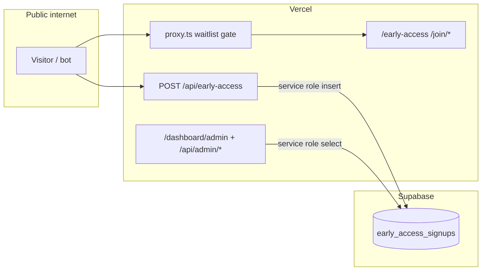

# Waitlist & Public Surface Security Hardening Plan

**Date:** 2026-06-19  
**Scope:** Production waitlist mode (`APP_MODE=waitlist`), `/early-access`, `/join/[slug]`, `/privacy`, public APIs, admin ops paths, and adjacent routes that remain reachable.  
**Goal:** Reduce risk of signup abuse, PII leakage, injection, and misconfiguration before scaling email campaigns.

---

## Executive summary

The waitlist stack is **architecturally sound** for a pre-launch landing: signup writes go through a server API with Zod validation and service-role Supabase; RLS is enabled with **no anon/authenticated policies** on `early_access_signups`; waitlist proxy gating blocks booking/dashboard surfaces; webhooks verify signatures; React renders expert copy without `dangerouslySetInnerHTML`.

The **highest practical risks today** are not XSS on the landing page — they are **abuse of the public signup API**, **weak distributed rate limiting on Vercel serverless**, **email enumeration**, **production env misconfiguration** (`ENABLE_DEMO_AUTH`), and **concentration of PII** (emails) behind a single admin session boundary.

Recommended priority: **P0 config + edge rate limits → P1 bot resistance + error hygiene → P2 observability and admin hardening**.

---

## Attack surface map (waitlist production)

| Surface | Public? | Auth | Data sensitivity |
|---------|---------|------|------------------|
| `GET /early-access`, `/join/[slug]`, `/privacy` | Yes | None | Low (static + DB-backed expert roster) |
| `POST /api/early-access` | Yes | None | **Writes PII (email)** |
| `GET /api/admin/metrics` | No* | Admin session | **Reads all waitlist emails (250 rows)** |
| `GET /dashboard/admin` | No* | Admin session | Same via client |
| `POST /api/webhooks/*` | Yes | HMAC signature | Medium (side effects) |
| Vercel Analytics custom events | Client | N/A | Low (no email; `ref` only) |

\*Blocked by proxy unless admin session exists (demo cookie or Supabase auth when enabled).



---

## STRIDE threat model (focused)

| Threat | Target | Current control | Gap |
|--------|--------|-----------------|-----|
| **Spoofing** | Admin dashboard | Encrypted session cookie; `requireApiRole('admin')` on API | Demo auth on preview; no MFA |
| **Tampering** | Signup payload | Zod schema; parameterized Supabase insert | Arbitrary `referrer` strings (500 chars) |
| **Repudiation** | Signup spam | None | No audit log of signups by IP/hash |
| **Information disclosure** | Emails | RLS blocks direct anon DB access | API returns `alreadyRegistered`; 500 leaks `error.message`; admin JSON exposes emails |
| **Denial of service** | `/api/early-access` | In-memory IP rate limit | **Not durable across Vercel instances**; no global cap |
| **Elevation** | Full app in waitlist | `resolveWaitlistRoute` + `isProtectedAppSurfaceEnabled` | `ENABLE_DEMO_AUTH=true` in prod unlocks everything |

---

## Findings

### P0 — Fix before next marketing blast

#### 1. In-memory rate limiting is ineffective on Vercel serverless

`early-access-rate-limit.ts` uses a process-local `Map`. Each lambda instance has its own counter; cold starts reset state. A distributed botnet can bypass limits easily.

**Recommendation:** Layer defenses:
- **Vercel Firewall / WAF** rate rule on `POST /api/early-access` (per IP, e.g. 10/min).
- **Durable store:** Upstash Redis or Vercel KV keyed by IP + optional email hash (same pattern as future booking limits).
- Keep in-memory limit as a fast first line, not the only line.

**Files:** `src/lib/waitlist/early-access-rate-limit.ts`, Vercel project settings, optional new `src/lib/rate-limit-kv.ts`.

#### 2. Production configuration guardrails

If `APP_MODE=waitlist` and `ENABLE_DEMO_AUTH=true` on **Production**, `isProtectedAppSurfaceEnabled()` becomes true — proxy stops waitlist-only gating and `/auth` + booking surfaces reopen.

**Recommendation:**
- Add **build-time or startup validation** (`src/lib/env-production-guard.ts`): in Vercel Production, fail build or log fatal if `ENABLE_DEMO_AUTH=true`.
- Document Vercel env checklist: Production = `APP_MODE=waitlist`, `ENABLE_DEMO_AUTH=false`, `ENCRYPTION_KEY` set.
- Optional: CI check in GitHub Action reading expected prod env names (no secret values).

**Files:** `src/lib/app-mode.ts`, `next.config.ts` or `instrumentation.ts`, `docs/how-to/waitlist-production-checklist.md`.

#### 3. Email enumeration via signup API

Duplicate emails return `success: true, alreadyRegistered: true` vs new signups `alreadyRegistered: false`. Attackers can probe whether an address is on the list.

**Recommendation (pick one):**
- **Uniform response:** Always return the same headline/body whether new or duplicate (UI already has `getEarlyAccessSuccessDisplay` — align API to not leak distinction to unauthenticated clients).
- **Rate limit + monitoring** if product wants to keep distinct copy for UX.

**Files:** `src/app/api/early-access/route.ts`, `waitlist-signup-form.tsx`, E2E specs.

---

### P1 — Harden within 1–2 sprints

#### 4. No bot resistance on public signup

Single field email form with no CAPTCHA, honeypot, or proof-of-work. Email blast traffic will attract list bombing and SEO spam emails.

**Recommendation:**
- **Cloudflare Turnstile** or **hCaptcha** on `WaitlistSignupForm` (invisible mode); verify server-side in `/api/early-access`.
- **Honeypot field** (CSS-hidden `website` input — reject if filled).
- Optional **double opt-in** later (out of scope for current single opt-in product decision).

**Files:** `waitlist-signup-form.tsx`, `early-access-schema.ts`, `route.ts`, `.env.example`.

#### 5. Server error information disclosure

```ts
// route.ts — 500 path exposes raw Error.message
return NextResponse.json({ success: false, error: message }, { status: 500 });
```

Can leak Supabase/infra details to attackers.

**Recommendation:** Log server-side; return generic `"Something went wrong. Try again."` for 500. Keep field-level errors only for 400 validation.

#### 6. Unvalidated `referrer` storage

`referrer` accepts any string ≤500 chars from client (`?ref=` or join default). Not XSS (not rendered as HTML in admin — verify admin UI escapes), but enables **analytics pollution** and DB junk.

**Recommendation:**
- Validate against pattern `^[a-z0-9][a-z0-9-]{0,98}[a-z0-9]$` (or taxonomy allowlist from `docs/how-to/marketing-referrer-taxonomy.md`).
- Server-side: if `ref` fails validation, store `null` or `(invalid)` bucket.
- Mirror rule in `parseEarlyAccessReferrer` / new `sanitizeEarlyAccessReferrer`.

#### 7. Missing explicit security headers

`next.config.ts` has no `headers()` for CSP, `X-Frame-Options`, `Referrer-Policy`, `Permissions-Policy`. Vercel may add some defaults; explicit policy reduces clickjacking and tightens script sources.

**Recommendation:**
- Add `headers` in `next.config.ts` with baseline:
  - `X-Frame-Options: DENY` (or `SAMEORIGIN`)
  - `Referrer-Policy: strict-origin-when-cross-origin`
  - `X-Content-Type-Options: nosniff`
  - CSP: start **report-only** (`Content-Security-Policy-Report-Only`) to avoid breaking Vercel Analytics / Daily embeds, then enforce.
- Consider Vercel Firewall managed rules.

#### 8. Admin PII exposure surface

`/api/admin/metrics` returns up to **250 plaintext emails** to any valid admin session. Acceptable for ops, but high impact if session stolen.

**Recommendation:**
- Production: migrate ops to **Supabase Auth** admin users (disable demo cookie on prod).
- Restrict `ADMIN_EMAILS` on any preview that uses demo auth.
- Add **audit log** row when admin metrics fetched (who/when).
- Future: mask emails in UI (`c***@example.com`) with reveal-on-click.

---

### P2 — Defense in depth & monitoring

#### 9. Per-email rate limit

IP limits alone fail for NAT and allow one IP to spray many emails. Add secondary limit: max N signups per normalized email per day (DB check or KV).

#### 10. Signup abuse monitoring

Alert on anomalies: signups/hour >> baseline, referrer entropy spike, single IP > threshold. Use Vercel Observability + custom log line from API (`waitlist_signup_ok|reject` without email — hash only).

#### 11. Request body hardening

- Reject non-JSON `Content-Type`.
- Cap body size (e.g. 4KB) before `request.json()`.
- Reject HTTP methods other than POST on `/api/early-access`.

#### 12. Join page slug probing

`/join/[slug]` returns 404 for unknown slugs — good. No open redirect. Expert bio in metadata is truncated — good. Continue using React text nodes only for DB strings.

#### 13. Dependency & secret hygiene (repo-wide)

- Run `npm audit` / Dependabot on schedule.
- Confirm `SUPABASE_SERVICE_ROLE_KEY` never in `NEXT_PUBLIC_*`.
- Rotate `ENCRYPTION_KEY` procedure documented if cookie compromise suspected.

---

## What is already in good shape (no change required)

| Control | Location |
|---------|----------|
| RLS on `early_access_signups`, no anon INSERT policy | `20260604120000_early_access_signups.sql` |
| Service-role-only DB writes for signup | `api/early-access/route.ts` |
| Zod email validation | `early-access-schema.ts` |
| Waitlist route allowlist | `waitlist-routes.ts`, `proxy.ts` |
| API routes blocked in waitlist except allowlist | `resolveWaitlistRoute` → 404 |
| E2E session bootstrap disabled when demo auth off | `api/e2e/session/route.ts` |
| Dev operator routes 404 in production | `api/dev/session-operator/route.ts` |
| Stripe/Daily webhooks signature verification | `api/webhooks/*` |
| Session cookie `httpOnly`, `secure` in prod | `session.ts` |
| Analytics events exclude email | `waitlist-analytics.ts` |
| Parameterized Supabase queries (slug lookup) | `mentor-directory.ts` |

---

## Implementation phases

### Phase A — Quick wins (1–2 days, no new vendors)

| # | Task | Effort |
|---|------|--------|
| A1 | Production env guard (`ENABLE_DEMO_AUTH` + `APP_MODE`) | S |
| A2 | Generic 500 messages on early-access API | S |
| A3 | Referrer regex validation server-side | S |
| A4 | Honeypot field on signup form | S |
| A5 | Security headers (non-CSP first) | S |
| A6 | Vercel WAF rate limit on `POST /api/early-access` | S (ops) |

### Phase B — Abuse resistance (3–5 days)

| # | Task | Effort |
|---|------|--------|
| B1 | Turnstile/hCaptcha server + client | M |
| B2 | KV/Redis-backed rate limits | M |
| B3 | Uniform signup API response (enumeration fix) | S |
| B4 | Per-email rate limit | M |
| B5 | Signup abuse logging (hashed IP/email) | S |

### Phase C — Admin & compliance (1 week)

| # | Task | Effort |
|---|------|--------|
| C1 | Supabase Auth for production admin (deprecate demo cookie on prod) | L |
| C2 | Admin metrics audit log | M |
| C3 | Email masking in admin UI | S |
| C4 | CSP report-only → enforce after analytics verification | M |

---

## Verification checklist (post-implementation)

- [ ] `curl -X POST /api/early-access` spam from single IP → 429 at WAF and app layer
- [ ] `curl` from multiple IPs still capped by KV global limits
- [ ] Duplicate email probe cannot distinguish new vs existing (or rate-limited heavily)
- [ ] Invalid `referrer` (`<script>`, 500-char garbage) rejected or nulled
- [ ] Honeypot filled → silent reject or 400
- [ ] CAPTCHA token missing/invalid → 400
- [ ] Production build fails or warns if `ENABLE_DEMO_AUTH=true` + waitlist
- [ ] `GET /api/admin/metrics` without session → 401
- [ ] `GET /api/book` in waitlist prod → 404 from proxy
- [ ] Security headers present on `/early-access` (securityheaders.com scan)
- [ ] Supabase: confirm no policy grants anon/authenticated on `early_access_signups`
- [ ] npm audit: no critical unfixed vulns in production deps

---

## Test ledger (when implementing)

| Area | Test type |
|------|-----------|
| Referrer validation | Unit tests in `early-access-schema.test.ts` |
| Rate limit KV | Unit tests with mocked store |
| Enumeration-neutral API | E2E + API route tests |
| Honeypot / CAPTCHA | E2E with stub verifier in test env |
| Env guard | Unit test `app-mode` / new guard module |
| Proxy allowlist regression | Existing `waitlist-routes.test.ts` |

---

## Decision ledger

| Decision | Rationale |
|----------|-----------|
| Prioritize edge + KV rate limits over CAPTCHA alone | Bots bypass client-only controls; serverless memory limits are weak |
| Keep single opt-in for launch | Double opt-in reduces conversion; defer unless abuse forces it |
| Uniform API response recommended for enumeration | 11 real signups — list is already valuable PII |
| CSP in report-only first | Vercel Analytics + future video embeds need allowlist tuning |
| Do not expose waitlist emails via anon Supabase | Already correct; maintain service-role-only pattern |

---

## Out of scope (this plan)

- Full penetration test / bug bounty
- SOC2 / formal compliance program
- Encrypting emails at rest in Postgres (Supabase disk encryption is platform-level)
- WAF rules for non-waitlist routes when `APP_MODE=full`

---

## Suggested first PR

**Title:** `feat: waitlist signup hardening (rate limits, referrer validation, env guard)`

Bundle Phase A items A1–A5 + Vercel WAF documentation in `docs/how-to/waitlist-production-checklist.md`. Follow with Phase B CAPTCHA + KV in a second PR.